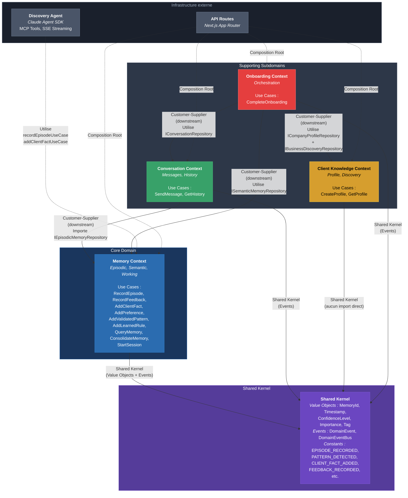
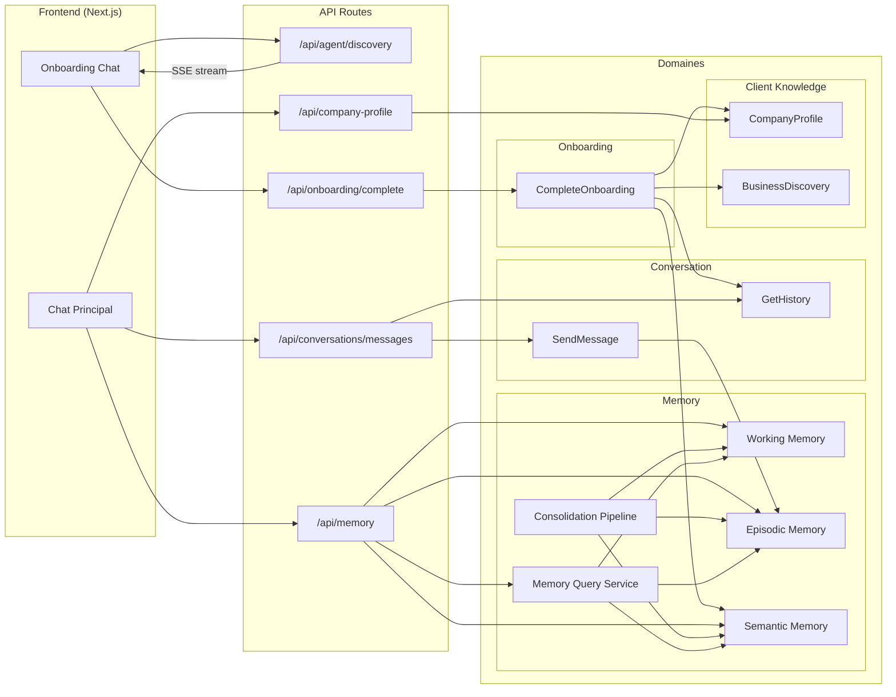

# Context Map -- Architecture DDD de Marketing AI

> **Derniere mise a jour** : 2026-02-07
> **Statut** : Documentation initiale basee sur l'analyse du code source

---

## 1. Vue d'ensemble

Marketing AI est un assistant IA specialise en marketing qui apprend progressivement le contexte business de chaque client. L'architecture est organisee en **4 Bounded Contexts** et un **Shared Kernel**, suivant les principes du Domain-Driven Design strategique.

### Bounded Contexts

| Bounded Context | Description | Fichiers racine |
|-----------------|-------------|-----------------|
| **Memory** | Systeme de memoire a trois niveaux (Working, Episodic, Semantic) inspire des sciences cognitives. Gere l'enregistrement d'episodes, la detection de patterns emergents, la consolidation progressive des connaissances et l'interrogation transversale de la memoire. C'est le coeur de l'intelligence adaptative du systeme. | `src/domains/memory/` |
| **Conversation** | Gere le flux conversationnel entre l'utilisateur et l'assistant. Responsable de l'historique des messages, de l'envoi de messages et de la generation de reponses. Orchestre l'interaction en s'appuyant sur la memoire episodique pour tracer les echanges. | `src/domains/conversation/` |
| **Client Knowledge** | Centralise la connaissance structuree sur le client : profil d'entreprise (CompanyProfile) et donnees de decouverte business (BusinessDiscovery). Fournit un modele riche et normalise du contexte client. | `src/domains/client-knowledge/` |
| **Onboarding** | Orchestre le processus d'accueil d'un nouveau client. Coordonne la creation du profil, l'enrichissement de la memoire semantique, la sauvegarde de l'historique conversationnel et la publication de l'evenement de completion. C'est un contexte orchestrateur qui ne possede pas de donnees propres. | `src/domains/onboarding/` |
| **Shared Kernel** | Fournit les Value Objects immutables (MemoryId, Timestamp, ConfidenceLevel, Importance, Tag) et l'infrastructure d'evenements domaine (DomainEvent, DomainEventBus). Partage par tous les contextes. | `src/domains/shared/` |

---

## 2. Diagramme de Context Map

---

## 3. Classification des subdomains

| Subdomain | Type | Investissement actuel | Investissement recommande | Justification |
|-----------|------|----------------------|--------------------------|---------------|
| **Memory** | **Core Domain** | Eleve | Eleve | C'est l'avantage concurrentiel du systeme. Le triple modele de memoire (Working, Episodic, Semantic) avec consolidation progressive est ce qui differencie Marketing AI d'un simple chatbot. 9 use cases, 3 repositories, 2 services domaine. |
| **Conversation** | Supporting | Moyen | Moyen | Necessaire au fonctionnement mais ne constitue pas un differenciateur. Le `SendMessageUseCase` depend directement de Memory (couplage a noter). Pourrait a terme utiliser un LLM plus sophistique que le `RandomResponseGenerator` actuel. |
| **Client Knowledge** | Supporting | Moyen | Eleve (a renforcer) | Le modele `BusinessDiscovery` est tres riche (8 blocs structures) mais les use cases du contexte sont minimalistes (CRUD simple). Le vrai potentiel de ce contexte est sous-exploite : il devrait porter plus de logique metier d'analyse client. |
| **Onboarding** | Supporting | Moyen | Moyen | Contexte orchestrateur avec un seul use case riche (`CompleteOnboarding`). Bien concu comme point de coordination entre les 3 autres contextes. Ne necessite pas d'investissement supplementaire majeur. |
| **Shared Kernel** | Generic | Faible | Faible | Bien dimensionne : 5 Value Objects et un EventBus synchrone. Doit rester minimal pour eviter le couplage excessif. |

---

## 4. Relations detaillees

### 4.1. Conversation --> Memory (Customer-Supplier)

- **Type** : Customer-Supplier (Memory est le supplier upstream, Conversation est le customer downstream)
- **Couplage** : `SendMessageUseCase` importe directement `IEpisodicMemoryRepository` depuis `@/domains/memory/ports`
- **Contrat** : Conversation appelle `recordEpisode()` pour enregistrer chaque message utilisateur comme episode de type `"interaction"`
- **Direction des donnees** : Conversation ecrit dans Memory (enregistrement d'episodes)
- **Fichier source** : `src/domains/conversation/use-cases/send-message.ts` (ligne 2)
- **Risque** : Couplage direct au niveau des ports. Si l'interface `IEpisodicMemoryRepository` change, le contexte Conversation est impacte.
- **Recommandation** : Envisager un decouplage par evenement domaine (`MESSAGE_SENT` est deja publie mais pas consomme pour l'enregistrement en memoire -- c'est l'inverse qui serait ideal).

### 4.2. Onboarding --> Memory (Customer-Supplier)

- **Type** : Customer-Supplier (Memory est le supplier upstream)
- **Couplage** : `CompleteOnboardingUseCase` importe `ISemanticMemoryRepository` depuis `@/domains/memory/ports`
- **Contrat** : Onboarding appelle `addClientFact()` massivement pour enrichir la memoire semantique avec les donnees de decouverte (metadata, probleme, valeur, audiences, marketing, business, hypotheses strategiques)
- **Direction des donnees** : Onboarding ecrit dans Memory (enrichissement semantique)
- **Fichier source** : `src/domains/onboarding/use-cases/complete-onboarding.ts` (lignes 3, 48-210)
- **Risque** : Fort couplage -- Onboarding connait intimement la structure de `BusinessDiscovery` ET l'interface de `ISemanticMemoryRepository`. Toute evolution de l'un ou l'autre impacte ce use case.
- **Recommandation** : Introduire un Anti-Corruption Layer (ACL) ou un service de traduction entre le modele BusinessDiscovery et les ClientFacts.

### 4.3. Onboarding --> Client Knowledge (Customer-Supplier)

- **Type** : Customer-Supplier (Client Knowledge est le supplier upstream)
- **Couplage** : `CompleteOnboardingUseCase` importe `ICompanyProfileRepository` et `IBusinessDiscoveryRepository`
- **Contrat** : Onboarding sauvegarde le `BusinessDiscovery` et cree un `CompanyProfile` a partir des donnees de decouverte
- **Direction des donnees** : Onboarding ecrit dans Client Knowledge (creation de profil et stockage de discovery)
- **Fichier source** : `src/domains/onboarding/use-cases/complete-onboarding.ts` (lignes 1-2, 29-46)
- **Risque** : Modere -- la transformation de `BusinessDiscovery` vers `CompanyProfile` est codee en dur dans le use case (lignes 37-45). La logique de mapping pourrait appartenir a Client Knowledge.

### 4.4. Onboarding --> Conversation (Customer-Supplier)

- **Type** : Customer-Supplier (Conversation est le supplier upstream)
- **Couplage** : `CompleteOnboardingUseCase` importe `IConversationRepository`
- **Contrat** : Onboarding sauvegarde l'historique de l'entretien de decouverte dans le repository de conversation via `addBulk()`
- **Direction des donnees** : Onboarding ecrit dans Conversation (sauvegarde d'historique)
- **Fichier source** : `src/domains/onboarding/use-cases/complete-onboarding.ts` (lignes 4, 212-216)
- **Risque** : Faible -- couplage minimal via l'interface du repository.

### 4.5. Memory (interne) : Consolidation Pipeline

- **Type** : Relation interne au contexte Memory
- **Mecanisme** : Le `ConsolidationPipeline` orchestre le flux Working -> Episodic -> Semantic
  - `consolidateWorkingToEpisodic()` : Transfere les sessions de travail terminees en episodes
  - `consolidateEpisodicToSemantic()` : Promeut les patterns emergents (>= 3 occurrences) en patterns valides, et les feedbacks recurrents en preferences
  - `pruneOldEpisodes()` : Supprime les episodes de plus de 30 jours
- **Fichier source** : `src/domains/memory/services/consolidation-pipeline.ts`
- **Invariants** : Seuil de promotion = 3 occurrences, retention episodique = 30 jours

### 4.6. Discovery Agent --> Memory (Infrastructure)

- **Type** : Relation d'infrastructure (pas un contexte domaine a proprement parler)
- **Couplage** : Les tools de l'agent Discovery (`saveDiscoveryBlock`) importent directement `recordEpisodeUseCase` et `addClientFactUseCase` depuis le Composition Root
- **Contrat** : L'agent enregistre les blocs de decouverte valides comme episodes de type `"discovery"` et enrichit optionnellement la memoire semantique
- **Fichier source** : `src/tools/discovery/index.ts` (lignes 6, 49-68)
- **Risque** : Couplage d'infrastructure correct -- passe par le Composition Root plutot que par les repositories directement.

### 4.7. Communication par evenements domaine

Les evenements suivants sont definis dans le Shared Kernel (`src/domains/shared/domain-events.ts`) :

| Evenement | Publie par | Consomme par | Statut |
|-----------|------------|-------------|--------|
| `EPISODE_RECORDED` | (declare, non publie) | -- | Non utilise |
| `PATTERN_DETECTED` | (declare, non publie) | -- | Non utilise |
| `PATTERN_PROMOTED` | (declare, non publie) | -- | Non utilise |
| `CLIENT_FACT_ADDED` | `AddClientFactUseCase` | -- | Publie, non consomme |
| `PREFERENCE_UPDATED` | `AddPreferenceUseCase` | -- | Publie, non consomme |
| `FEEDBACK_RECORDED` | (declare, non publie) | -- | Non utilise |
| `ONBOARDING_COMPLETED` | `CompleteOnboardingUseCase` | -- | Publie, non consomme |
| `MESSAGE_SENT` | `SendMessageUseCase` | -- | Publie, non consomme |

**Constat** : Le bus d'evenements est en place et des evenements sont publies, mais **aucun handler n'est enregistre**. Les evenements partent "dans le vide". C'est un mecanisme de decouplage prepare mais pas encore active.

---

## 5. Diagramme de flux de donnees

---

## 6. Composition Root -- Point de cablage unique

Le fichier `src/infrastructure/composition-root.ts` est le **seul endroit** ou les implementations concretes (couche `data/`) sont injectees dans les use cases (couche `domains/`). Aucun autre fichier ne devrait importer directement depuis `@/data`.

### Instances cablee :

| Use Case | Dependances injectees |
|----------|----------------------|
| `recordEpisodeUseCase` | `episodicMemory` |
| `recordFeedbackUseCase` | `episodicMemory` |
| `queryMemoryUseCase` | `memoryQuery` (service) |
| `consolidateMemoryUseCase` | `consolidationPipeline`, `memoryQuery` |
| `startSessionUseCase` | `workingMemory` |
| `addClientFactUseCase` | `semanticMemory` |
| `addPreferenceUseCase` | `semanticMemory` |
| `addValidatedPatternUseCase` | `semanticMemory` |
| `addLearnedRuleUseCase` | `semanticMemory` |
| `sendMessageUseCase` | `conversationRepository`, `episodicMemory`, `responseGenerator` |
| `getHistoryUseCase` | `conversationRepository` |
| `getProfileUseCase` | `companyProfileRepository` |
| `createProfileUseCase` | `companyProfileRepository` |
| `completeOnboardingUseCase` | `companyProfileRepository`, `businessDiscoveryRepository`, `semanticMemory`, `conversationRepository` |

---

## 7. Risques architecturaux identifies

### Risque 1 : Evenements domaine non consommes
**Severite** : Moyenne
**Description** : 4 evenements sont publies (`CLIENT_FACT_ADDED`, `PREFERENCE_UPDATED`, `ONBOARDING_COMPLETED`, `MESSAGE_SENT`) mais aucun handler n'est enregistre. 4 autres constantes sont declarees mais jamais publiees.
**Impact** : Le potentiel de decouplage n'est pas exploite. Les relations Customer-Supplier pourraient etre remplacees par des reactions evenementielles.
**Recommandation** : Activer les handlers ou supprimer les evenements non utilises pour eviter la confusion.

### Risque 2 : Couplage direct Conversation -> Memory
**Severite** : Moyenne
**Description** : `SendMessageUseCase` depend directement de `IEpisodicMemoryRepository` pour enregistrer les interactions.
**Impact** : Violation du principe d'autonomie des Bounded Contexts. Le contexte Conversation ne devrait pas connaitre les details internes de Memory.
**Recommandation** : Deplacer l'enregistrement en memoire vers un handler qui reagit a l'evenement `MESSAGE_SENT` (deja publie).

### Risque 3 : Onboarding comme "God Use Case"
**Severite** : Faible a Moyenne
**Description** : `CompleteOnboardingUseCase` depend de 4 repositories issus de 3 contextes differents et contient 8 methodes privees d'enrichissement.
**Impact** : Forte concentration de logique. Tout changement dans la structure de `BusinessDiscovery` impacte ce fichier.
**Recommandation** : Decomposer en sous-etapes pilotees par evenements (ex: `ONBOARDING_COMPLETED` declenche l'enrichissement de la memoire semantique).

### Risque 4 : Types partages hors du Shared Kernel
**Severite** : Faible
**Description** : Les types `@/types/memory.ts` et `@/types/index.ts` sont des fichiers de types partages qui ne font pas partie du Shared Kernel (`src/domains/shared/`). Ils sont importes par les ports ET les implementations.
**Impact** : Confusion sur la frontiere entre le Shared Kernel et les types transversaux.
**Recommandation** : Migrer les types domaine dans leurs contextes respectifs ou les integrer formellement au Shared Kernel.

### Risque 5 : Absence de persistance
**Severite** : Elevee (pour la production)
**Description** : Tous les repositories sont des implementations in-memory (`InMemoryConversationRepository`, `EpisodicMemoryStore`, etc.). Les donnees sont perdues a chaque redemarrage.
**Impact** : Acceptable en phase de prototypage, bloquant pour la mise en production.
**Recommandation** : Implementer des adaptateurs persistants (PostgreSQL, SQLite, etc.) derriere les memes interfaces de ports.
