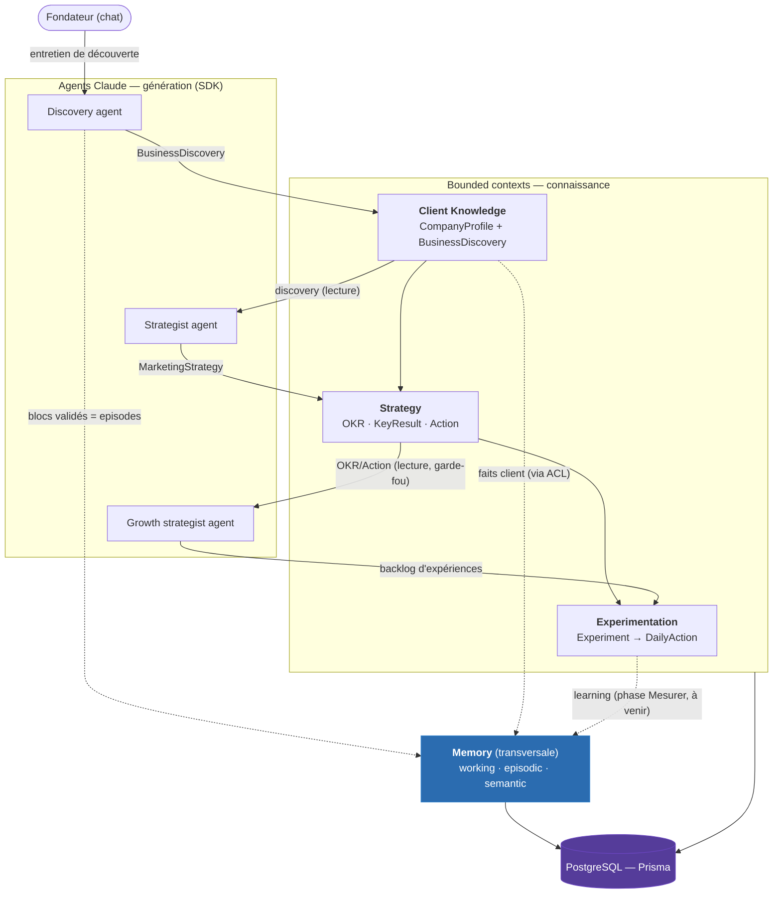
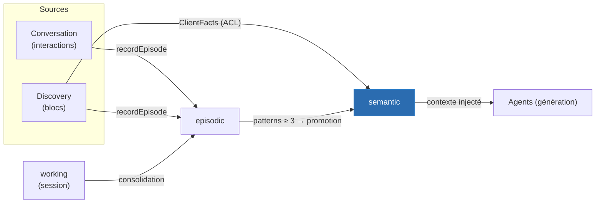
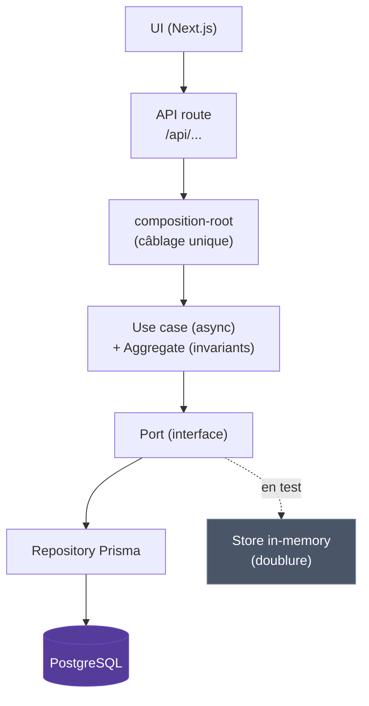

# Flux de données dans Marketing AI

> Ce document explique **comment la donnée circule** dans l'application : d'une conversation avec le fondateur jusqu'à un backlog d'expériences marketing persisté en base. Type Diataxis : **explanation** (comprendre, pas exécuter).

---

## Contexte et motivation

Marketing AI n'est pas un générateur de contenu jetable : c'est une machine qui **apprend progressivement le contexte d'un client** et le transforme, étape par étape, en exécution marketing mesurable. Cette promesse impose une contrainte structurante sur la donnée : chaque étape doit **enrichir** un socle de connaissance plutôt que repartir de zéro.

D'où une architecture en **pipeline de bounded contexts** (DDD), où la sortie d'un contexte devient l'entrée du suivant, le tout adossé à une **mémoire transversale** qui capitalise et à une **persistance PostgreSQL** qui rend le savoir durable.

Comprendre le flux de données, c'est comprendre deux mouvements simultanés :
1. un mouvement **horizontal** — le pipeline produit qui affine la connaissance (`Discovery → Client Knowledge → Strategy → Experimentation`) ;
2. un mouvement **vertical** — à chaque étape, une descente depuis les agents Claude (génération) vers le domaine (validation) puis la base (persistance).

---

## Vue d'ensemble : le flux de domaine

Lecture du diagramme : la donnée **descend** des agents (qui *génèrent* via le SDK Claude) vers les contextes (qui *valident et structurent*), **traverse** le pipeline de gauche à droite, et **se dépose** dans la mémoire transversale et dans Postgres. Les flèches pleines sont le chemin principal ; les pointillées sont les enrichissements de mémoire.

---

## Concepts clés

### Le pipeline produit affine la connaissance

Chaque contexte consomme la sortie validée du précédent, sans jamais le muter :

- **Discovery** mène l'entretien et produit un `BusinessDiscovery` (8 blocs : problème, valeur, audiences, marketing, contexte business…).
- **Client Knowledge** en dérive un `CompanyProfile` normalisé et conserve la discovery brute.
- **Strategy** lit la discovery pour produire un diagnostic, des `OKR` et un plan d'`Action` priorisé — la source de vérité du « quoi faire ».
- **Experimentation** décline ces actions en `Experiment` falsifiables (cadence hebdo) puis en `DailyAction` shippables (cadence quotidienne) — le « comment/quand exécuter ».

Le fil de causalité est conservé de bout en bout : un `DailyAction` remonte à son `Experiment`, qui pointe un `KeyResult`, qui sert un `OKR`. Aucune donnée n'est orpheline — c'est ce qui distingue la machine d'un canon à contenu.

### La mémoire est transversale, pas une étape

Là où le pipeline est séquentiel, la **mémoire** est un socle que tous les contextes alimentent et interrogent. Elle imite la mémoire humaine à trois niveaux :

- **working** — la session de travail courte (transitoire) ;
- **episodic** — les événements horodatés (interactions, blocs de discovery, résultats) ;
- **semantic** — la connaissance consolidée (faits client, préférences, patterns validés, règles apprises).

Une **pipeline de consolidation** fait remonter l'information d'un niveau à l'autre (`working → episodic → semantic`) : les patterns récurrents (≥ 3 occurrences) sont promus en savoir durable. C'est l'organe qui fait que la machine « apprend » au fil des boucles.

Un point de design notable : la traduction entre le langage d'Onboarding (`BusinessDiscovery`) et celui de Memory (`ClientFact`) passe par une **couche anti-corruption** (`MemoryFacade`). C'est le seul point où les deux vocabulaires se rencontrent — un choix délibéré pour éviter que Memory connaisse la structure de la discovery.

### Deux moteurs distincts : agents vs domaine

Le flux croise systématiquement deux mondes qu'il est essentiel de ne pas confondre :

- **Les agents Claude (SDK)** — Discovery, Strategist, Growth strategist — *génèrent* du contenu probabiliste. Ils vivent dans `src/agents` et `src/tools`, s'exécutent via `query()` du SDK, et produisent du JSON structuré.
- **Le domaine** — *valide, applique les invariants et persiste* de façon déterministe. Il vit dans `src/domains`, ignore tout du SDK, et n'accepte que des données conformes à ses règles métier.

Entre les deux, un endpoint « structured output » sert de frontière : l'agent propose, le domaine dispose. Par exemple, le Growth strategist produit des *candidats* d'expériences ; c'est `GenerateBacklogUseCase` qui refuse ceux sans seuil mesurable et les persiste.

### La descente verticale : du clic à la base

Indépendamment du contexte, une requête suit toujours les mêmes couches. La donnée traverse des **ports asynchrones** (interfaces de repository) dont l'implémentation concrète est injectée en un point unique (le *composition root*).

Ce sont les **ports** qui rendent ce double branchement possible : en production le port pointe vers une implémentation Prisma/Postgres ; en test, vers une doublure in-memory. Le domaine, lui, ne voit qu'une interface.

---

## Décisions de design et justifications

### Pourquoi un pipeline plutôt qu'un service monolithique

Découper en contextes qui se passent la main rend chaque étape **indépendamment testable et compréhensible**, et permet d'arrêter le flux à n'importe quel maillon (on peut vivre avec Discovery + Strategy sans Experimentation). Le coût : une donnée parfois recopiée d'un contexte à l'autre (la discovery est lue par Strategy, ses faits sont aussi en mémoire). C'est un compromis assumé en faveur de l'autonomie des contextes.

### Pourquoi des ports asynchrones

Le domaine a d'abord été écrit avec des ports **synchrones** (stores in-memory). Le passage à PostgreSQL a imposé de rendre les ports `async` (l'I/O réseau l'est), ce qui s'est propagé dans les use-cases et les routes. L'alternative — un store synchrone masquant l'I/O — aurait été un mensonge fragile. Rendre l'asynchronisme explicite jusqu'aux frontières est plus honnête et plus sûr.

### Pourquoi un schéma relationnel hybride (avec JSONB)

La persistance normalise les agrégats structurés (Experiment, Strategy, leurs enfants) en tables relationnelles, mais stocke les **documents profondément imbriqués et libres** en JSONB :

**Tout normaliser :** offre des requêtes SQL fines, mais transforme `BusinessDiscovery` (8 blocs très nichés) en une soixantaine de tables pour une valeur quasi nulle.

**Tout en JSONB :** simple, mais perd l'indexation et les contraintes relationnelles sur les entités qui en bénéficient (les `Experiment`, les `OKR`).

Le choix retenu — relationnel pour les collections structurées, JSONB pour `BusinessDiscovery`, `episode.data` et le scratchpad de session — capture l'essentiel des deux mondes. Voir [ADR-0001](./adr/0001-bounded-context-experimentation.md) pour le détail du raisonnement sur le contexte Experimentation.

---

## Implications et conséquences

- **La mémoire est le moat.** Comme tout converge vers `semantic`, plus la machine tourne, plus elle connaît finement le client. Le flux est conçu pour que cette connaissance s'apprécie avec le temps.
- **Le flux n'est pas encore totalement bouclé.** La phase « Mesurer → Apprendre » (résultats d'expériences réinjectés en mémoire sémantique via l'événement `EXPERIMENT_CONCLUDED`) est modélisée mais pas câblée — c'est le chaînon manquant entre Experimentation et Memory (pointillé dans le premier diagramme).
- **Les événements de domaine sont publiés mais non consommés.** Le bus existe (`MESSAGE_SENT`, `STRATEGY_GENERATED`, `EXPERIMENT_CREATED`…) ; aucun handler n'y réagit encore. Le découplage événementiel est *préparé*, pas *activé*.
- **`projects/*` reste hors flux.** Ces routes prototypes utilisent des stores in-memory directement, en marge des bounded contexts — à ne pas confondre avec le pipeline décrit ici.

---

## En résumé

La donnée entre par une **conversation**, est structurée par des **agents Claude**, validée et durcie par le **domaine**, capitalisée par une **mémoire à trois niveaux**, et persistée en **PostgreSQL** derrière des ports asynchrones. Horizontalement, elle s'affine le long du pipeline `Discovery → Client Knowledge → Strategy → Experimentation` ; verticalement, elle descend des agents vers la base à chaque étape. Le tout est pensé pour qu'aucune donnée ne soit orpheline et que la connaissance compound.

---

## Pour aller plus loin

- [CONTEXT_MAP.md](./CONTEXT_MAP.md) — la cartographie complète des bounded contexts, leurs relations et le câblage (vue reference/structure).
- [UBIQUITOUS_LANGUAGE.md](./UBIQUITOUS_LANGUAGE.md) — la définition précise de chaque terme du domaine cité ici (Episode, OKR, Experiment, ClientFact…).
- [ADR-0001](./adr/0001-bounded-context-experimentation.md) — pourquoi le contexte Experimentation et son modèle de données existent.
- [ddd-aggregates-design.md](./ddd-aggregates-design.md) — comment les agrégats encapsulent les invariants traversés par ce flux.
