# DDD Aggregates - Architecture Diagrams

## 1. Aggregate Structure Overview

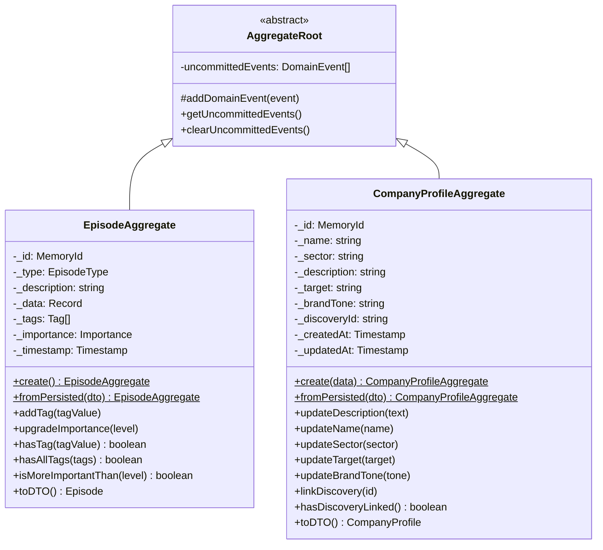

## 2. Episode Aggregate with Value Objects

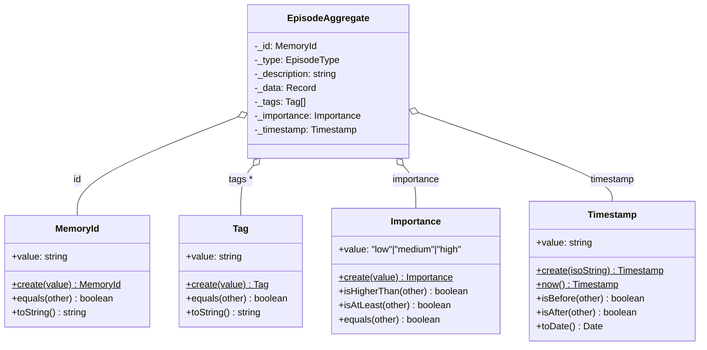

## 3. CompanyProfile Aggregate Lifecycle

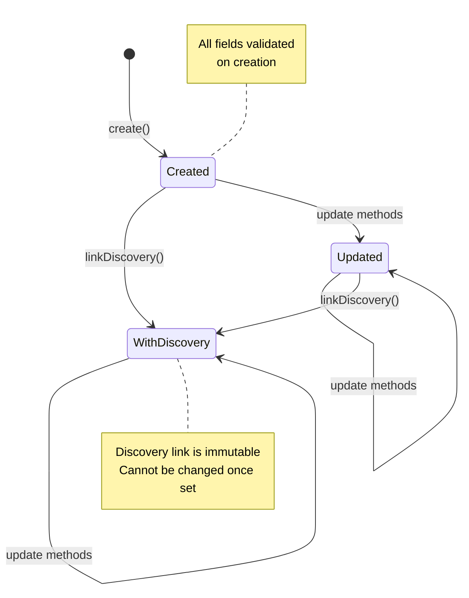

## 4. Episode Importance Upgrade Flow

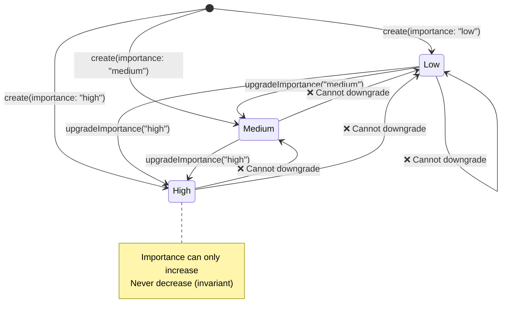

## 5. Domain Event Flow

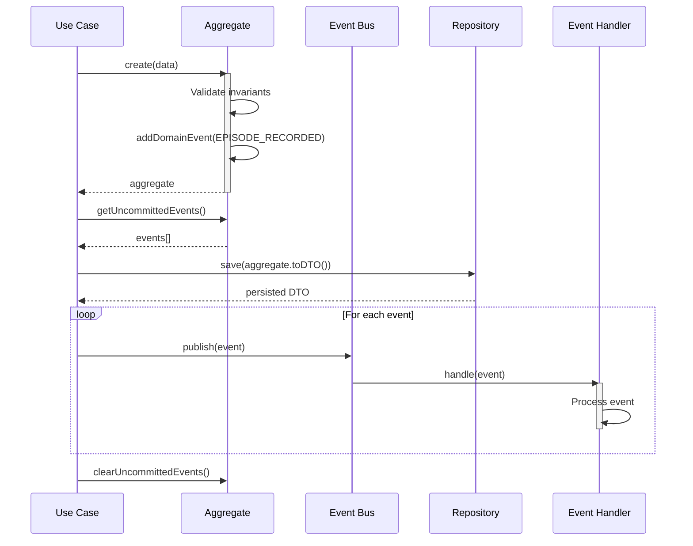

## 6. Use Case to Repository Flow

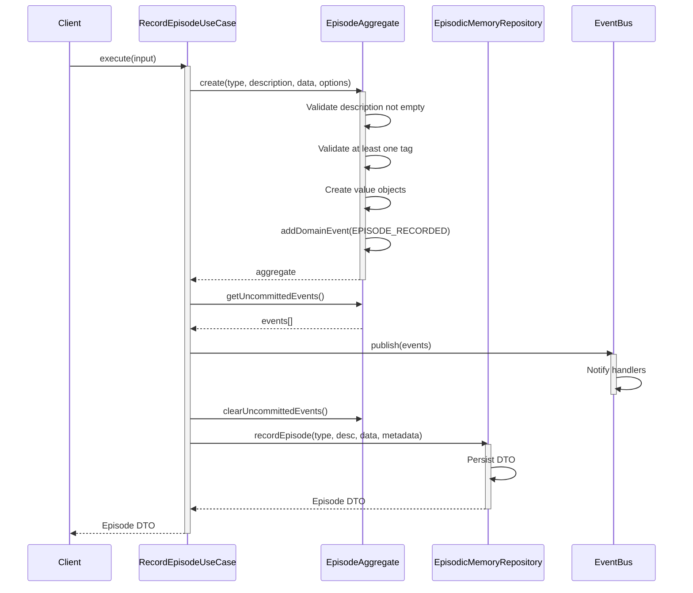

## 7. Aggregate Boundary and Repository Pattern

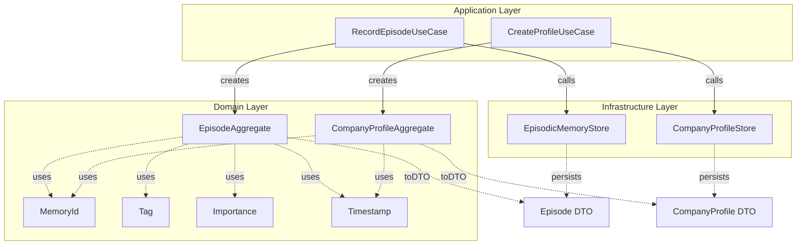

## 8. Validation Chain

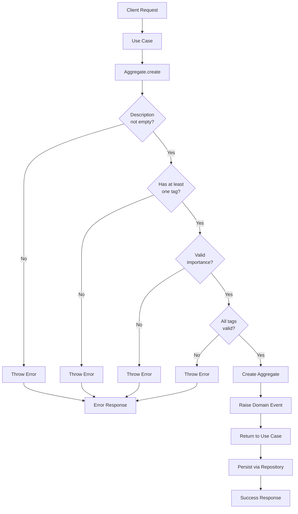

## 9. Aggregate Encapsulation

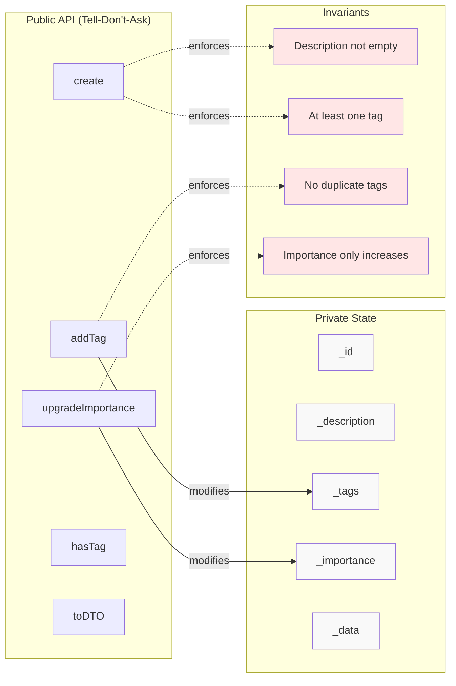

## 10. Migration Path: Anemic to Rich

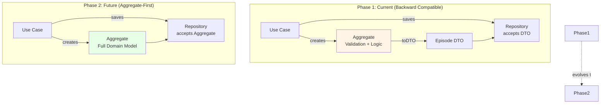

## 11. Domain Events Timeline

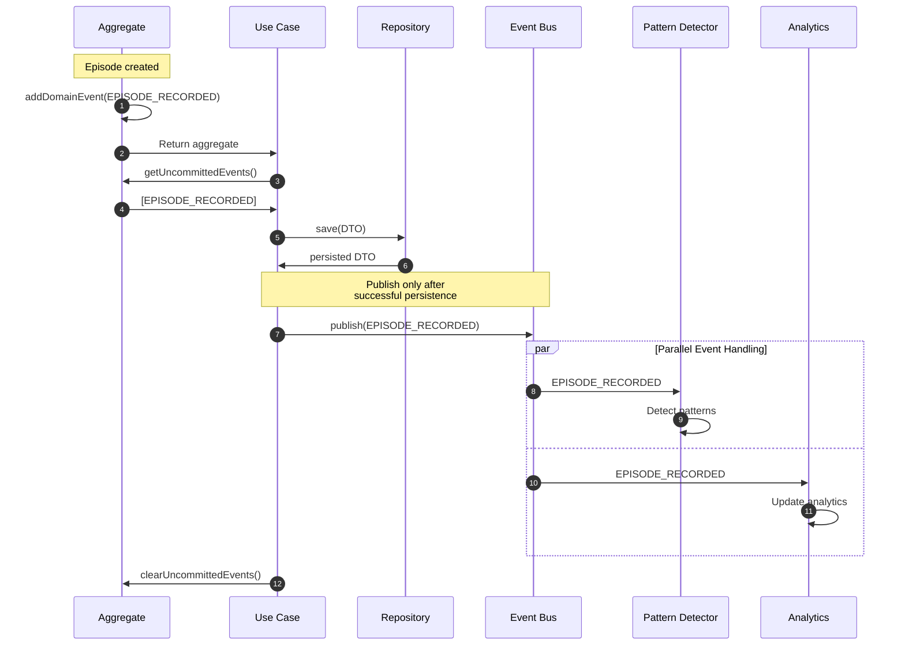

## 12. Aggregate Size Metrics

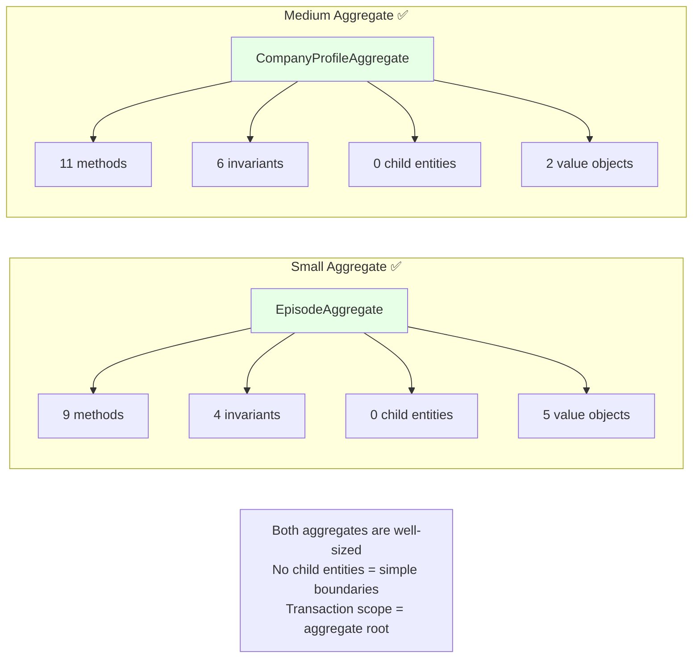

## Design Principles Visualization

### Principle 1: Encapsulation
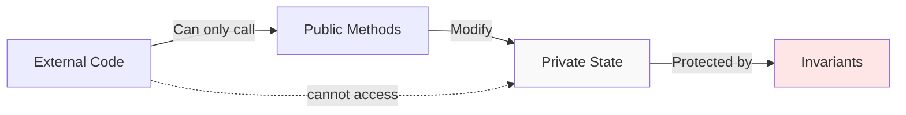

### Principle 2: Immutability
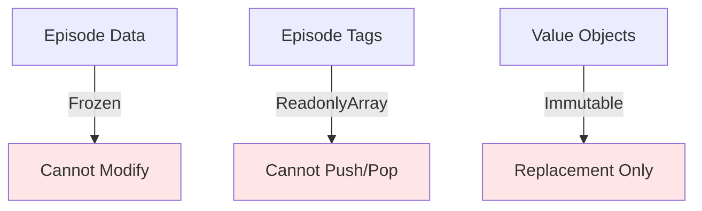

### Principle 3: Tell-Don't-Ask
```mermaid
graph LR
    G[✅ Good:<br/>episode.upgradeImportance("high")]
    B[❌ Bad:<br/>episode.setImportance("high")]

    G2[✅ Good:<br/>profile.linkDiscovery(id)]
    B2[❌ Bad:<br/>profile.setDiscoveryId(id)]

    style G fill:#e6ffe6
    style B fill:#ffe6e6
    style G2 fill:#e6ffe6
    style B2 fill:#ffe6e6
```

## Conclusion

These diagrams illustrate:
- **Aggregate structure** and inheritance hierarchy
- **Value object composition** within aggregates
- **State transitions** and lifecycle management
- **Domain event flow** from creation to handling
- **Validation chains** ensuring invariants
- **Encapsulation boundaries** protecting internal state
- **Migration path** from anemic to rich models
- **Design principles** in practice

Use these diagrams for:
- Onboarding new developers
- Architecture documentation
- Design discussions
- Code review reference
